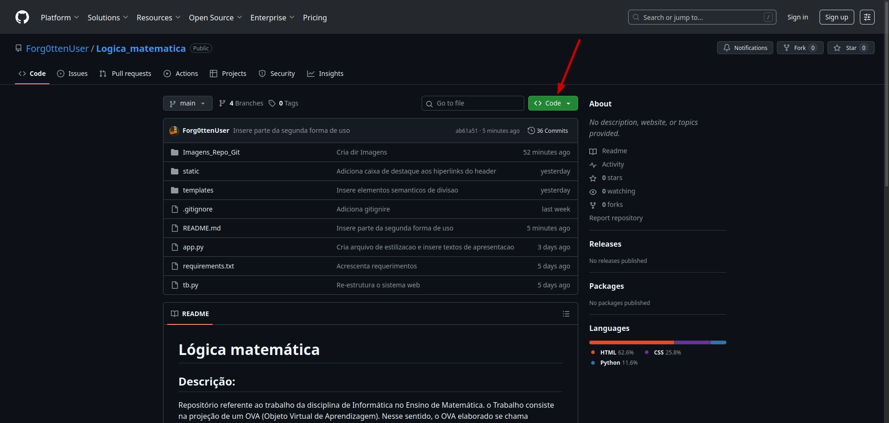
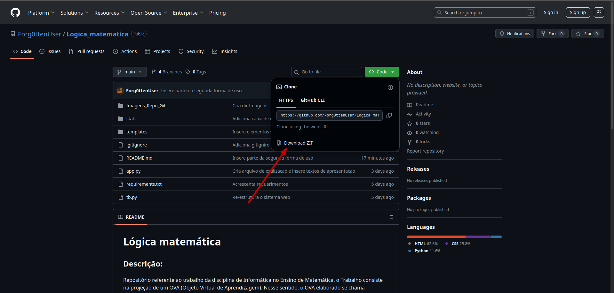

# Lógica matemática

## Descrição:

Repositório referente ao trabalho da disciplina de Informática no Ensino de Matemática. O trabalho consiste na projeção de um OVA (Objeto Virtual de Aprendizagem).
Nesse sentido, o OVA elaborado se chama "Deulógica", um simulador de tabelas-verdade para o cálculo proposicional, também conhecido como lógica proposicional.

## Como executar a aplicação:

Há duas maneiras de executar este sistema web: clicar no link abaixo escrito "Clique aqui para rodar o site" e baixar e rodar a aplicação no próprio computador.

### 1ª forma:

[Clique aqui para rodar o site](https://huggingface.co/spaces/Shzous/Run-Logica_matematica)

**Detalhe**: 


Esse topo da página não faz parte de modo algum do OVA. Infelizmente, para hospedar algumas aplicações web em servidores na Internet, geralmente, é necessário pagar mediante assinaturas de planos. No caso desta aplicação, foi feito o uso de um serviço gratuito que impõe certas limitações, sendo uma delas apresentada na imagem acima. Portanto, desconsidere a utilização
do conteúdo da imagem.

Além disso, caso o site esteja com alguma marcação do tipo "sleeping", reinicie o space. Siga as orientações intuitivas presentes onde esta aplicação web está hospedada.

### 2ª forma:

Esta segunda forma é como um desenvolvedor faz. 

#### Requisitos:

- Ter o interpretador python 3.10 (ou superior) instalado. *De preferência,
utilize o 3.12*.
- Encontrar o shell do seu sistema operacional, isto é, em termos simples, o terminal do seu computador. **Além disso, saber comandos básicos facilitará, pois a execução da aplicação se baseará na interação com esse terminal. Porém, não é obrigatório saber os comandos, já que haverá um passo a passo**.

    - No Windows, utiliza-se geralmente o *CMD* ou o *PowerShell*.
    - No Linux, utiliza-se geralmente o shell *Bash*.

#### Passo a Passo:

1. No topo desta página, clique no botão verde, como indica a imagem:

2. Agora, clique em "Download ZIP" para baixar o projeto no seu computador, conforme indica a imagem:

3. Crie uma pasta especial para o mover o arquivo para tal pasta. Após isso, descompacte-o e delete o arquivo baixado de extensão *.zip*. Note que, ao término da descompactação, uma pasta, cujo nome é *"Logica_matematica-main"*,
será criada dentro da pasta feita por você.

##### No Linux:

1. Ainda na pasta especial que você criou, clique sobre ela com o botão direito do mouse
e procure alguma opção com uma expressão semelhante a esta: "Abrir em um terminal". Depois, clique nessa opção. O terminal inicializará, e uma janela  geralmente preta será exibida.

2. Digite ou copie o comando abaixo diretamente no terminal e, depois, tecle "Enter". Será criado um ambiente virtual, a fim de evitar conflitos entre pacotes do sistema.
```bash
python3 -m venv venv
```
3. Ainda no terminal, ative o ambiente virtual com o seguinte comando e, depois, tecle "Enter":
```bash
source venv/bin/activate
```
4. No terminal, atualize o gestor de pacotes do python com o seguinte comando e, depois, tecle "Enter":
```bash
pip install --upgrade pip
```
5. Mude para o diretório da aplicação web com o seguinte comando e, depois, tecle "Enter":
```bash
cd Logica_matematica-main
```
6. Agora, instale as depedências necessárias com o seguinte comando e, depois, tecle "Enter":
 ```bash
pip install -r requirements.txt
```

##### No Windows:

1. Ainda na pasta especial que você criou, vá na barra de endereço, digite "cmd" e, depois, tecle "Enter". Uma janela preta será inicializada. Em caso de dúvida, veja este [vídeo](https://youtube.com/shorts/gtTd6R0ffnE?si=NXnWTGhiXpTodqF5).

2. Digite ou copie o comando abaixo diretamente no cmd e, depois, tecle "Enter". Será criado um ambiente virtual, a fim de evitar conflitos entre pacotes do sistema.
```bat
python -m venv venv
```
3. Ainda no cmd, ative o ambiente virtual com o seguinte comando e, depois, tecle "Enter":
```
venv\Scripts\activate
```
4. No cmd, atualize o gestor de pacotes do python com o seguinte comando e, depois, tecle "Enter":
```bat
python -m pip install --upgrade pip
```
5. Mude para o diretório da aplicação web com o seguinte comando e, depois, tecle "Enter":

```bat
cd Logica_matematica-main
```
6. Agora, instale as depedências necessárias com o seguinte comando e, depois, tecle "Enter":
 ```bat
pip install -r requirements.txt
```

#### Execução da aplicação web:

1. No terminal, digite o seguinte comando e tecle "Enter":

##### No Linux:
```bash
python3 app.py
```
##### No Windows:
```bat
python app.py
```
2. Vá no seu navegador e digite, na barra de endereço, "http://127.0.0.1:5000". Alternativamente, no terminal, posicione o mouse sobre tal endereço e pressione *CTRL + botão esquerdo do mouse*.

#### Encerrar a aplicação web:

Para finalizar, no terminal, pressione *CTRL+C*. Caso queira executar a aplicação novamente, retorne a seção **Execução da aplicação web** e siga os passos.


## Considerações finais: 

Se ocorrer alguma anormalidade, procure por conta própria a solução. Infelizmente, não há como inserir neste documento todos os possíveis erros e as suas respectivas soluções.

## Autores:

- Guilherme da Silva Mariano
- Daniel Ferreira Pereira da Silva
- Lucas das Chagas de Souza
